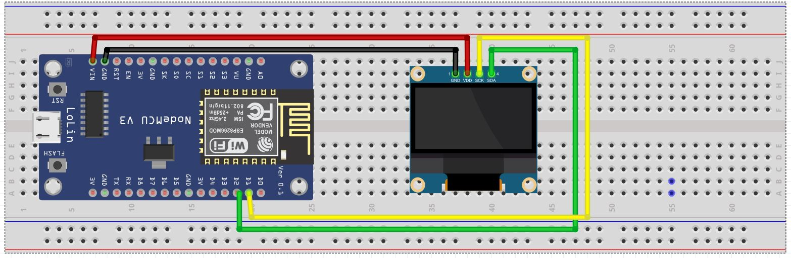

# ESP8266 Internet Clock with OLED Display (IST Format)

This project creates an **Internet-based real-time clock (RTC)** using an **ESP8266 NodeMCU** and an **OLED Display (I2C)**. The time is fetched from an **NTP (Network Time Protocol) server**, ensuring accurate synchronization with **Indian Standard Time (IST, UTC +5:30)**.

## Features
- Displays **Time in 12-hour format (AM/PM)**
- Shows **Date in DD/MM/YYYY format**
- Displays **Day of the week**
- Fetches time from the internet via **NTP Server**
- Uses an **OLED Display (I2C, SSD1306)** for output
- Works on **Wi-Fi** with automatic time synchronization

## Components Required
- **ESP8266 NodeMCU**
- **OLED Display (128x64, I2C, SSD1306)**
- **Jumper Wires**

## Circuit Diagram (Wiring)

### OLED Display (I2C) Connection to ESP8266:

| OLED Pin | ESP8266 Pin |
|----------|------------|
| VCC      | 3V3        |
| GND      | GND        |
| SCL      | D1 (GPIO5) |
| SDA      | D2 (GPIO4) |

## Code Setup
### Libraries Required
Before uploading the code, install the following libraries in **Arduino IDE**:

1. **U8g2** - For OLED Display ([Install from Library Manager](https://github.com/olikraus/u8g2))
2. **NTPClient** - To fetch time from the internet
3. **ESP8266WiFi** - To connect ESP8266 to Wi-Fi

### Uploading the Code
Use the following **Arduino code** to run the project:

```cpp
#include <ESP8266WiFi.h>
#include <WiFiClient.h>
#include <NTPClient.h>
#include <WiFiUdp.h>
#include <U8g2lib.h>

const char* ssid = "your_SSID";
const char* password = "your_PASSWORD";

U8G2_SSD1306_128X64_NONAME_F_HW_I2C u8g2(U8G2_R0, U8X8_PIN_NONE);
WiFiUDP udp;
NTPClient timeClient(udp, "in.pool.ntp.org", 19800, 60000);  // UTC +5:30 for IST

const char* daysOfWeek[] = {"Sunday", "Monday", "Tuesday", "Wednesday", "Thursday", "Friday", "Saturday"};

void setup() {
  Serial.begin(115200);
  WiFi.begin(ssid, password);
  while (WiFi.status() != WL_CONNECTED) {
    delay(1000);
    Serial.println("Connecting to WiFi...");
  }
  Serial.println("Connected to WiFi");
  timeClient.begin();
  u8g2.begin();
}

void loop() {
  timeClient.update();
  unsigned long epochTime = timeClient.getEpochTime();
  struct tm *ptm = gmtime((time_t *)&epochTime);
  ptm->tm_hour += 5;
  ptm->tm_min += 30;
  if (ptm->tm_min >= 60) { ptm->tm_min -= 60; ptm->tm_hour += 1; }
  if (ptm->tm_hour >= 24) { ptm->tm_hour -= 24; ptm->tm_mday += 1; }

  int hours = ptm->tm_hour;
  int minutes = ptm->tm_min;
  int seconds = ptm->tm_sec;
  int day = ptm->tm_mday;
  int month = ptm->tm_mon + 1;
  int year = ptm->tm_year + 1900;
  String period = (hours >= 12) ? "PM" : "AM";
  if (hours > 12) hours -= 12;
  if (hours == 0) hours = 12;
  String weekday = daysOfWeek[ptm->tm_wday];

  u8g2.clearBuffer();
  u8g2.setFont(u8g2_font_ncenB08_tr);
  u8g2.setCursor(0, 10);
  u8g2.print("Time: ");
  u8g2.print(hours);
  u8g2.print(":" );
  if (minutes < 10) u8g2.print("0");
  u8g2.print(minutes);
  u8g2.print(":" );
  if (seconds < 10) u8g2.print("0");
  u8g2.print(seconds);
  u8g2.print(" " + period);
  u8g2.setCursor(0, 30);
  u8g2.print("Date: ");
  u8g2.print(day);
  u8g2.print("/");
  u8g2.print(month);
  u8g2.print("/");
  u8g2.print(year);
  u8g2.setCursor(0, 50);
  u8g2.print("Weekday: ");
  u8g2.print(weekday);
  u8g2.sendBuffer();
  delay(1000);
}
```

## How It Works
1. The ESP8266 connects to Wi-Fi.
2. It fetches the current time from an **NTP server**.
3. The time is adjusted for **Indian Standard Time (UTC +5:30)**.
4. The **OLED display** shows:
   - **Time** in HH:MM:SS (AM/PM)
   - **Date** in DD/MM/YYYY format
   - **Day of the week**
5. The display updates every second.

## Troubleshooting
- **OLED not displaying anything?**
  - Check the **I2C wiring** (SDA, SCL connections).
  - Ensure the correct **OLED I2C address** (default is 0x3C).
  - Try **scanning I2C devices** using an I2C scanner sketch.

- **Wi-Fi not connecting?**
  - Double-check the **SSID and Password** in the code.
  - Ensure the **ESP8266 is near the router** for a strong signal.

## License
This project is open-source and free to use. Feel free to modify and improve it!

---

## 🔗 Connect with Me
[🌐 Website](https://electroiot.in)  
[✉️ Email](mailto:electroiot@hotmail.com)  
[📺 YouTube](https://www.youtube.com/@ElectroIoT-IN)  
[🔬 Hackster.io](https://www.hackster.io/Manoranjan2050)  
[📖 Instructables](https://www.instructables.com/member/ElectroIoTIN) 


